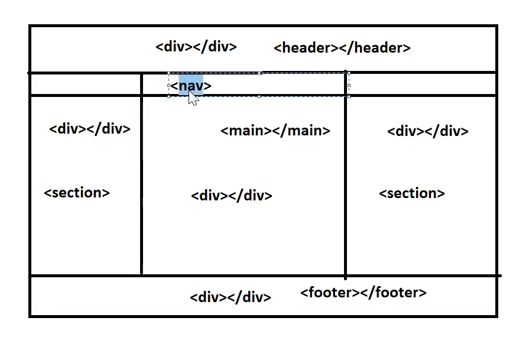

## HTML 

we know basics (html used for static pages)

HTML 5 was successful in market as it support API's like web socket , Web Worker API ,Storages API, Location API ,Drag and drop API's!! these are not available before HTML 5!!

1. Schematic elements - tag having clear cut meaning!!

    Before HTML 5

    

    After HTML 5

    

    we are using tags which tell what is it used for!!

2. Storages
    - Local Storage
    - Session Storage

    Login to flipkart we add some mobile to cart now due to some reason power off , so the item will still be in the cart!! even though browser still have data is called as Local Storage!!

    Suppose u do payment with credit card !! now after restart the data is lost that is in session storage!!

3. Cookies    

    - we only login to flipkart first time !! then the login credentials are stored in cookies!!

    - cookies are not safe

4. Web Socket API    

5. Web Worker To create more than one thread

6. Drag and Drop  API

7. Location API (to use google Map)

then we use CSS 3

1. Flex box (arrangement of elements with respect to x-axis or y-axis)

2. Grid box

3. Responsive Web Design(RWD) (execution of web page according to different devices)

    - we use media queries here

4. dimensions (px, em ,rem ,vh)    

5. colors ,background-colors